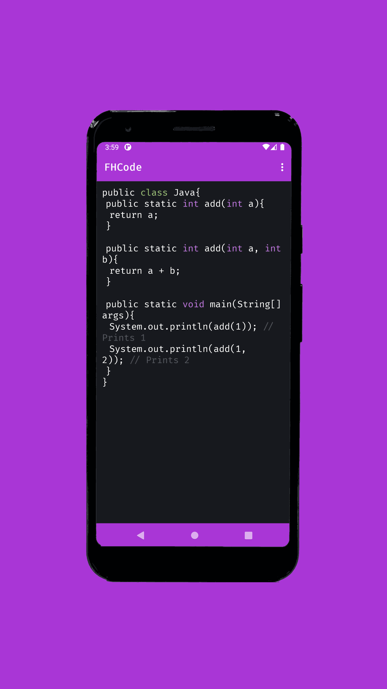
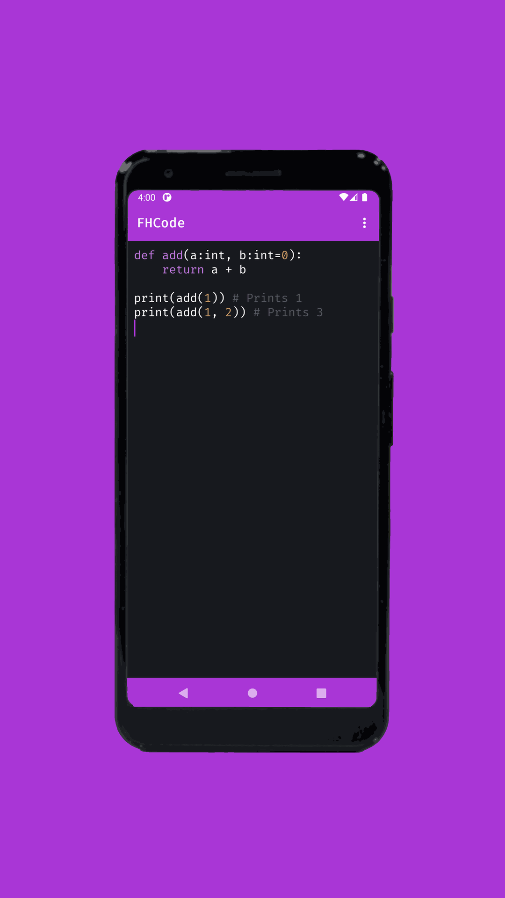
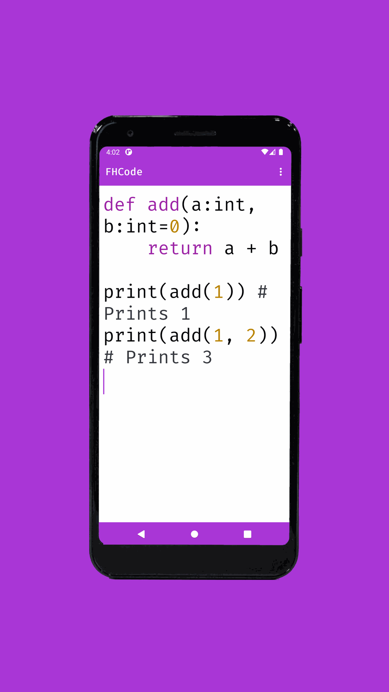
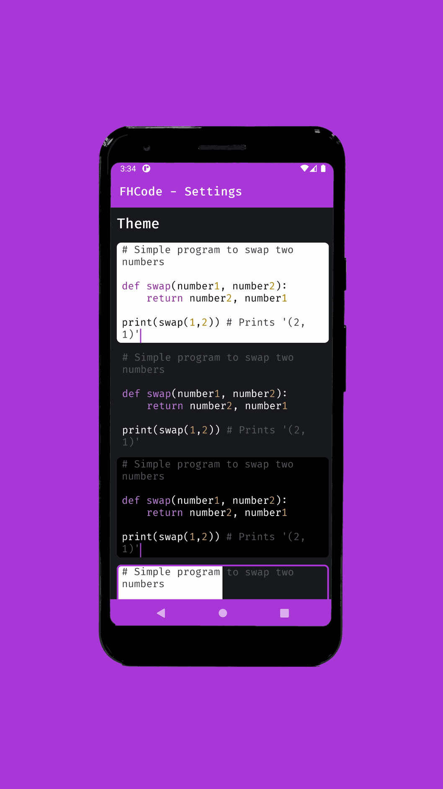
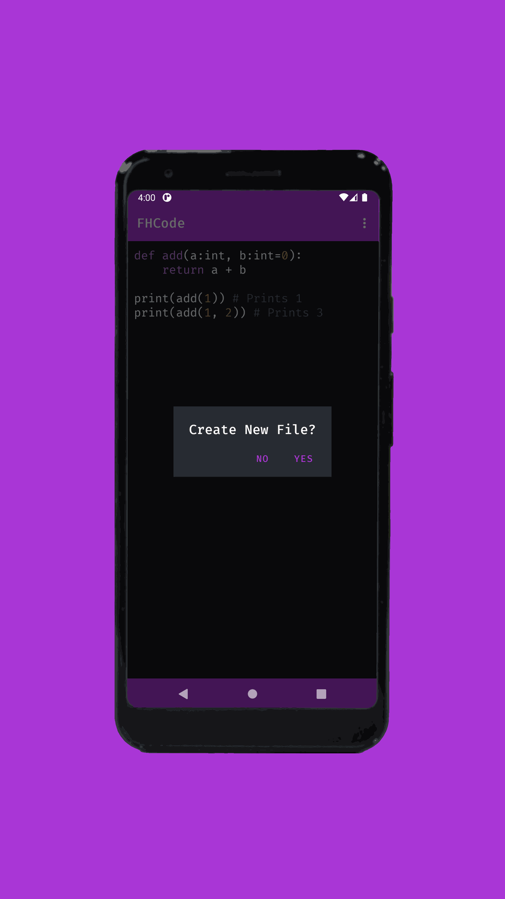
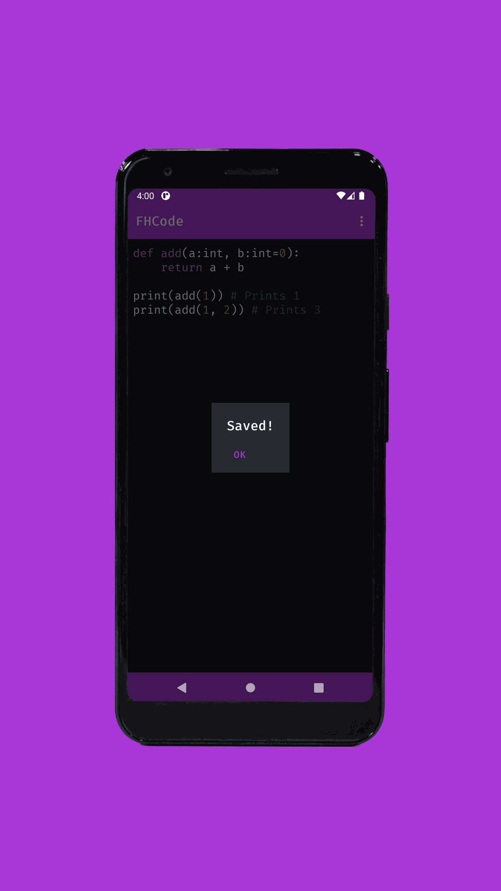

[](../../)
[](../../issues)
[](/LICENSE.md)
[](../../commits/master)
[](../../commits/master)
[](../../releases)

<!-- omit in toc -->
# Android.FHCode

Code editor for android


- [Features](#features)
- [Screenshots](#screenshots)
- [Documentation](#documentation)
- [Installation](#installation)
- [Gradle tasks](#gradle-tasks)
- [Kotlin and Android Version](#kotlin-and-android-version)
- [Building From Source](#building-from-source)
	- [Git Clone](#git-clone)
		- [Using The Command Line](#using-the-command-line)
		- [Using GitHub Desktop](#using-github-desktop)
	- [(or) Download Zip File](#or-download-zip-file)
	- [Download Android Studio](#download-android-studio)
- [Community Files](#community-files)
	- [Licence](#licence)
	- [Changelog](#changelog)
	- [Code of Conduct](#code-of-conduct)
	- [Contributing](#contributing)
	- [Security](#security)
	- [Support](#support)
	- [Development Info](#development-info)

## Features

- Create, edit and save code/ text files
- Syntax highlighting for Java, XML, Python using regex
- 4 Themes: Light, Dark, Black, Auto
- Configurable text size
- Launcher Shortcuts for Settings, About, New File

## Screenshots

<p>






</p>

## Documentation

A high-level overview of how the documentation is organized organized will help you know
where to look for certain things:

<!--
- [Tutorials](/documentation/tutorials) take you by the hand through a series of steps to get
  started using the software. Start here if you’re new.
-->
- The [Technical Reference](/documentation/reference) documents APIs and other aspects of the
  machinery. This documentation describes how to use the classes and functions at a lower level
  and assume that you have a good high-level understanding of the software.
<!--
- The [Help](/documentation/help) guide provides a starting point and outlines common issues that you
  may have.
-->

## Installation

You can install the app using the following methods, Follow the link to the listing on your
preferred store by clicking on one of the badges below, then download/install:

[](https://intradeus.github.io/http-protocol-redirector?r=obtainium://add/github.com/fredhappyface/Android.FHCode)
[](https://f-droid.org/en/packages/com.fredhappyface.fhcode/)
[](https://play.google.com/store/apps/details?id=com.fredhappyface.fhcode)
[](../../releases)


<!-- omit in toc -->
### Build from Source

Follow the steps in [Building from Source](link_to_building_from_source) section.

## Gradle tasks

- ktlintCheck (`gradlew ktlintCheck`): run ktlint over the codebase
- genDocs (`gradlew genDocs`): generate the api reference using dokka

## Kotlin and Android Version

This app has been written in Kotlin 1.9.0 with the Android Studio IDE.

- The target SDK version is 33 (Android 13)
- The minimum SDK version is 26 (Android 8 Oreo)

## Building From Source

1. Download or clone this GitHub repository
2. (If downloaded) Extract the zip archive
3. In Android Studio click File > Open and then navigate to the project file
(Android studio defaults to the directory of the last opened file)

### Git Clone

#### Using The Command Line

1. Press the Clone or download button in the top right
2. Copy the URL (link)
3. Open the command line and change directory to where you wish to
clone to
4. Type 'git clone' followed by URL in step 2

	```bash
	git clone https://github.com/FredHappyface/Android.FHCode
	```

More information can be found at
https://help.github.com/en/articles/cloning-a-repository

#### Using GitHub Desktop

1. Press the Clone or download button in the top right
2. Click open in desktop
3. Choose the path for where you want and click Clone

More information can be found at
https://help.github.com/en/desktop/contributing-to-projects/cloning-a-repository-from-github-to-github-desktop

### (or) Download Zip File

1. Download this GitHub repository
2. Extract the zip archive
3. Copy/ move to the desired location

### Download Android Studio

Download the Android Studio IDE from <https://developer.android.com/studio/>.
For Windows, double click the downloaded .exe file and follow the instructions
provided by the installer - it will download the Android emulator and the
Android SDK. Additional information can be found at
<https://developer.android.com/studio/install>

## Community Files

### Licence

MIT License
(See the [LICENSE](/LICENSE.md) for more information.)

### Changelog

See the [Changelog](/CHANGELOG.md) for more information.

### Code of Conduct

Our project welcomes individuals from diverse backgrounds and perspectives.
We are committed to providing a friendly, safe and welcoming environment for all. Please see the
[Code of Conduct](https://github.com/FredHappyface/.github/blob/master/CODE_OF_CONDUCT.md)
for more information.

### Contributing

Your contributions are valuable and help improve the project for everyone, please see the
[Contributing Guidelines](https://github.com/FredHappyface/.github/blob/master/CONTRIBUTING.md)
for more information.

### Security

If you discover a security vulnerability, we appreciate your responsible disclosure. Please see the
[Security Policy](https://github.com/FredHappyface/.github/blob/master/SECURITY.md)
for more information.

### Support

Thank you for using this project, I hope it is of use to you. Please keep in mind that
the folks working on this project are enthusiasts with various commitments such as work,
family, and other passions. See the
[Support Policy](https://github.com/FredHappyface/.github/blob/master/SUPPORT.md)
for more information.

### Development Info

Serves as a guide to various aspects of project development, including versioning, style guidelines, and recommended practices. Please see the
[Rationale](https://github.com/FredHappyface/.github/blob/master/DEVELOPMENT_INFO.md)
for more information.
